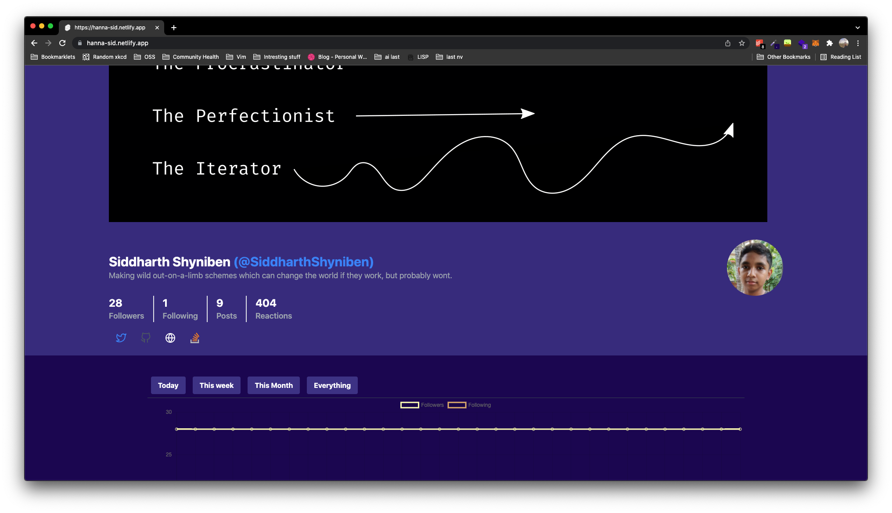

# Hanna: Beautiful Hashnode analytics for everyone

Hanna is a statistics app for Hashnode. It's short for "*Ha*shnode *An*alytics"
with an extra "n".

It's fully customizable, free and open source forever.

## Get it!

You can get your own dashboard with these simple steps:

Netlify will ask to fork the repo on your GitHub account. Fork it, then Rename
the `.github.sample` folder to `.github`

Run the init.js script: `node init.js`

Push your changes to GitHub, and verify if the GitHub action has started running
in the actions tab. If it runs, you are all set!
